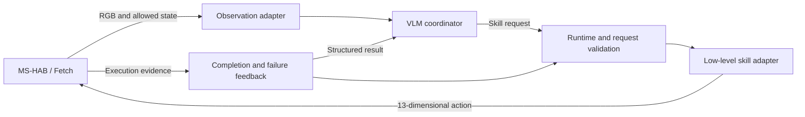

# Learning Bidirectional Semantic Interfaces for Reliable VLA Tool Use

**Bidirectional-VLA-Interface** is an early research implementation of an explicit invocation and feedback interface between a vision-language coordinator and robot skills.

The first milestone uses [ManiSkill-HAB (MS-HAB)](https://github.com/arth-shukla/mshab) and its Fetch mobile manipulator. A high-level VLM will select skills and react to execution feedback; interchangeable low-level policies will execute navigation and manipulation. The initial baseline reuses MS-HAB RL policies. Learning VLA adapters and requirement verifiers is future work.

[Status](#current-status) · [Architecture](#architecture) · [Setup](docs/reproduction.md) · [Evaluation](docs/evaluation.md) · [Roadmap](#roadmap)

## Current status

**Development snapshot — September 14, 2026.** CUDA, Vulkan, GPU physics, and RGBD rendering have been exercised on a single RTX A6000. A Fetch robot completed 60 control steps in `Empty-v1`, and a video was exported. This establishes the basic simulator installation; it does not establish task success in MS-HAB.

The `bvi` Python core now includes typed requests and feedback, a serial skill runtime, event logging, and injectable OpenAI/Anthropic transports. Its initial **28 CPU tests passed without paid API calls**. The asset/checkpoint downloader pins upstream revisions, verifies file hashes, and resumes interrupted downloads; real-task validation is still in progress.

| Gate | Acceptance criterion | Evidence available |
|---|---|---|
| G0: GPU and rendering | CUDA computation, NVIDIA Vulkan device, RGB/depth frames | Passed in an empty-scene smoke test |
| G1: MS-HAB environment | ReplicaCAD task reset/step, recorded observations and action contract, 200 steps | In progress; only the Fetch empty-scene interface has been exercised |
| G2: Official skills | Navigate, Pick, and Place each succeed at least once | Pending |
| G3: Skill composition | Navigate → Pick → Navigate while holding → Place, without teleportation | Pending |
| G4: VLM coordination | Real image input, structured requests, execution feedback, and subsequent decisions | Pending |

There is currently **no end-to-end VLM demonstration, trained VLA model, or benchmark score**. CPU protocol tests and scripted coordinators are infrastructure checks, not evidence of G2–G4.

## Architecture



The baseline uses one active skill at a time. Each skill owns the full Fetch action vector, including the base where the original policy requires it. Serial skill selection therefore preserves the whole-body behavior of the manipulation policies. Concurrent base/arm controllers will require explicit resource arbitration and are outside the first milestone.

Requests identify a skill, target, observation, supported requirements, and execution limits; requirement predicates express the desired effects. Results distinguish completion, failure, timeout, and uncertain evidence. The runtime validates requests, rejects unsupported requirements, bounds execution, and records the cause of each transition. See the [interface design](docs/architecture.md).

MS-HAB provides structured task plans and simulator success checks. The baseline must disclose which components use those signals: the official RL policies use privileged target state, and simulator completion checks are an oracle feedback baseline. A VLM must actually process images and issue requests before a run is described as VLM coordinated.

## Setup and reproduction

The tested simulator platform is **Ubuntu 22.04, NVIDIA RTX A6000 48 GB, Python 3.11, PyTorch 2.4.1 + CUDA 12.4, ManiSkill 3.0.0b18, and SAPIEN 3.0.0b1**. Installation uses the MS-HAB-compatible ManiSkill branch and records exact commits. A current default ManiSkill installation is not a substitute for this pinned environment.

Follow [setup and reproduction](docs/reproduction.md) for the tested version manifest, external assets, headless rendering, and the distinction between available checks and pending runners. API credentials are not required for environment setup or official policy checks. The VLM stage will use an explicit provider/model configuration and separately enabled paid requests.

Datasets, model weights, local credentials, and raw run directories are not distributed with this repository. Obtain upstream assets from their official hosts and retain their terms.

The `bvi` protocol/runtime core can be installed and checked without a simulator or API call:

```bash
python -m pip install -e .
python -m unittest discover -s tests -v
```

Simulator entrypoints are provided separately for asset setup, the G1 task smoke test, and official-policy execution. See [the execution sequence](docs/reproduction.md#execution-sequence) before running them; later gates remain unverified until their recorded acceptance criteria pass.

## Evaluation

The evaluation path is **single-skill checks → one diagnostic skill chain → matched official validation**. A video or a successful single task is a demonstration, not an aggregate benchmark result.

Every result must identify the scene and task-plan coverage, seeds, checkpoint revisions, navigation mode, horizon, success criteria, coordinator type, and access to privileged observations. Report failures and incomplete runs as well as successes. See [evaluation and reporting](docs/evaluation.md) for the protocol and reporting checklist.

## Roadmap

- [x] Verify CUDA, Vulkan, and a 60-step Fetch empty-scene rollout.
- [x] Implement the protocol, serial runtime, and injected-provider checks on CPU.
- [ ] Verify ReplicaCAD task loading and the official observation/action interfaces.
- [ ] Execute official Navigate, Pick, and Place checkpoints independently.
- [ ] Compose skills without resetting the physical state or teleporting.
- [ ] Add image-based VLM requests and feedback-driven decisions.
- [ ] Release a reproducible demonstration with logs, video, and failure analysis.
- [ ] Evaluate matched settings across the declared validation scenes and task plans.
- [ ] Study learned invocation semantics, requirement verification, and VLA adapters.
- [ ] Extend the runtime to overlapping navigation and manipulation.

## Acknowledgements and license

This project builds on [MS-HAB](https://github.com/arth-shukla/mshab) and [ManiSkill](https://github.com/haosulab/ManiSkill). [openpi](https://github.com/Physical-Intelligence/openpi) is a candidate future policy integration. The organization of this README follows common research-repository practices illustrated by these projects and [Habitat-Lab](https://github.com/facebookresearch/habitat-lab).

Original code in this repository is released under the [MIT License](LICENSE). Upstream code, datasets, robot assets, and model weights retain their own licenses; this repository's license does not grant rights to redistribute them. No upstream assets or checkpoints are bundled. There is no project publication or BibTeX entry yet; cite the upstream work when using its benchmark or policies.
