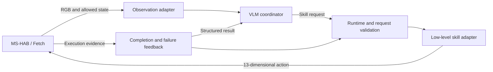

# Learning Bidirectional Semantic Interfaces for Reliable VLA Tool Use

**Bidirectional-VLA-Interface** is an early research implementation of an explicit invocation and feedback interface between a vision-language coordinator and robot skills.

**September 16 mainline (September 17 UTC):** manipulation uses **AC-DiT** on the laboratory server. [Current-observation progress calibration](docs/fetch-current-progress-calibration.md) is running after six fixed handoff-data trajectories (2 native Pick successes, 4 failures). Current-frame supervision, endpoint masks and real invocation-start anchors are implemented; the first20 updates passed native-freeze/four-bank/head checks. Final calibration and the two predeclared online checks are pending. The [earlier timing-only fix](docs/fetch-progress-timing-fix.md) still failed seed2025 at23.44cm. The AC-DiT action-token progress head remains an explicit architectural port; GPT/LightNav integration, actual navigation-handoff coverage, DROID and GRPO remain pending.

**Historical LIBERO run01:** [LIBERO tool-family / TAPT component experiment](docs/tapt-libero-run01.md) completed 2,000 real updates and all 15 fixed episodes. Original pi05_libero: **5/5**; GPT + original policy: **3/5**; GPT + four family adapters + learned progress: **0/5**. Learned progress triggered 28 actual switches/replans, but trained-system task-success acceptance failed. Six episodes were truncated by a character/UTF-8 validation mismatch; the report separates that implementation defect from task recovery failure. This is not a reproduction of the paper's score. [All 15 videos](docs/media/tapt-libero-2026-09-15-run01/README.md) · [Outcomes and per-call costs](docs/results/tapt-libero-2026-09-15-run01/evaluation.json) · [Author-fork source audit](docs/vlas-as-tools-code-audit.md).

The first milestone uses [ManiSkill-HAB (MS-HAB)](https://github.com/arth-shukla/mshab) and its Fetch mobile manipulator. A high-level VLM issues structured skill requests from image observations and execution feedback; interchangeable low-level policies execute navigation and manipulation. The initial baseline reuses MS-HAB RL policies. LightNav integration and Fetch pi0.5 adaptation are now under development; learning requirement verifiers is future work.

[Status](docs/tapt-libero-run01.md) · [Architecture](#architecture) · [Setup](docs/reproduction.md) · [Evaluation](docs/evaluation.md) · [Roadmap](#roadmap)

[Watch the real VLM demonstration — vlm-seed1.mp4](docs/media/vlm-baseline-2026-09-14/vlm-seed1.mp4) · [Read the diagnostic evidence](docs/evaluation.md#live-vlm-protocol-diagnostic) · [Run manifest](docs/results/seed1-diagnostic.json)

**Earlier LightNav control diagnostic:** [Watch the failed rollout — lightnav-control-003-trial2.mp4](docs/media/lightnav-control-003/lightnav-control-003-trial2.mp4) · [Results and limitations](docs/lightnav-control.md).
LightNav now drives Fetch through the adapter. After fixing a deferred-image bug,
a trial executed 270 control steps and 55 predictions, then stopped before the
benchmark navigation goal was satisfied. SAC manipulation was not reached.
Physical motion signs and a 40-step grasp hold passed separate calibration.
This historical trial uses oracle dispatch, not GPT/Opus, and precedes Fetch pi0.5 adaptation.

[A/B/C/D delivery plan and green-marker diagnosis](docs/abcd-delivery.md).

**Current A/B/C/D work:** [debugging evidence and Fetch adaptation](docs/abcd-debugging.md).
The [marker-free A chain — A-ppo-sac-clean.mp4](docs/media/abcd-baseline-reference/A-ppo-sac-clean.mp4) has been re-recorded.
[B: LightNav + SAC — B-lightnav-sac.mp4](docs/media/abcd-baseline-reference/B-lightnav-sac.mp4) completed the first-object chain
in 278 steps, with grasp maintained throughout carrying navigation.
The state-conditioned Fetch pi0.5 pilot completed 2,000 training steps but
[C and D both failed Pick](docs/abcd-debugging.md#fetch-pi05-adaptation).
Velocity, recovery-data, relative-base and workspace-camera pilots also failed Pick. The historical workspace-camera pilot used 1,228 frames including successful recovery tails; this does not establish C/D task success. [Audited workspace failures and videos](docs/abcd-debugging.md) · [Adaptation contract and commands](docs/workspace-adaptation.md).

## Earlier MS-HAB baseline status

**Development snapshot — September 14, 2026.** The first VLM–skill–simulation loop is running on an RTX A6000 with OpenAI `gpt-5.6-luna`. Six real model requests produced six successful skill invocations. The first **Navigate → Pick → Navigate while holding → Place** chain completed in 233 control steps; execution stopped at the six-request limit after 336 steps. **The full five-object TidyHouse task remains incomplete.**

This is a constrained interface demonstration: every decision had **one allowed skill/target pair**, supplied by oracle task metadata, and completion used the simulator's checks. It establishes real image input, structured invocation, continuous control, and feedback delivery. It does not establish autonomous planning or an advantage over a fixed dispatcher.

The `bvi` Python core includes typed requests and feedback, a serial skill runtime, event logging, injectable OpenAI/Anthropic transports, and an SSH bridge that keeps API credentials on the local computer. **Current local suite: 197 tests passed, 4 skipped; 15 targeted Torch checks passed on the lab CPU environment. No paid API calls.** The asset/checkpoint downloader pins upstream revisions, verifies file hashes, and resumes interrupted downloads.

| Gate | Acceptance criterion | Evidence available |
|---|---|---|
| G0: GPU and rendering | CUDA computation, NVIDIA Vulkan device, RGB/depth frames | Passed in an empty-scene smoke test |
| G1: MS-HAB environment | ReplicaCAD task reset/step, recorded observations and action contract, 200 steps | Passed: TidyHouse val, seed 0, build index 69, plan index 23; zero actions |
| G2: Official skills | Navigate, Pick, and Place each succeed at least once | Passed in the seed-1 per-object diagnostic; executed actions were finite and within controller bounds |
| G3: Skill composition | Navigate → Pick → Navigate while holding → Place, without teleportation | Passed for the first object in one continuous episode, 233 steps |
| G4: VLM coordination | Real image input, structured requests, execution feedback, and subsequent decisions | Passed as a constrained interface smoke test: six real GPT requests, with oracle targets and completion |

The [live run and evidence](docs/evaluation.md#live-vlm-protocol-diagnostic) establish a **single-scene engineering demonstration**. There is no aggregate benchmark score; the Fetch-trained pi0.5 pilot has not passed its task gate. The original G1 smoke test used 200 zero actions; successful policy execution and the VLM loop were verified separately.

The first official-policy run completed its 7,000-step horizon on one validation scene/plan and returned **0/1 task successes** (`success_once=0`, `success_at_end=0`). The trace advances from Navigate to Pick at step index 128, then records a cumulative-force failure at index 143. This is a preliminary diagnostic failure, not an estimate of full-benchmark performance. See the [run result and limitations](docs/evaluation.md#first-official-policy-diagnostic).

A subsequent seed-0 per-object oracle run completed Navigate, Pick, and navigation while holding before failing at Place after 470 steps. The successful VLM demonstration uses seed 1 and a different sampled plan; these runs are not a matched comparison of coordinators.

## Architecture



The baseline uses one active skill at a time. Each skill owns the full Fetch action vector, including the base where the original policy requires it. Serial skill selection therefore preserves the whole-body behavior of the manipulation policies. Concurrent base/arm controllers will require explicit resource arbitration and are outside the first milestone.

Requests identify a skill, target, observation, supported requirements, and execution limits; requirement predicates express the desired effects. Results distinguish completion, failure, timeout, and uncertain evidence. The runtime validates requests, rejects unsupported requirements, bounds execution, and records the cause of each transition. See the [interface design](docs/architecture.md).

MS-HAB provides structured task plans and simulator success checks. The baseline must disclose which components use those signals: the official RL policies use privileged target state, and simulator completion checks are an oracle feedback baseline. A VLM must actually process images and issue requests before a run is described as VLM coordinated.

## Setup and reproduction

The tested simulator platform is **Ubuntu 22.04, NVIDIA RTX A6000 48 GB, Python 3.11, PyTorch 2.4.1 + CUDA 12.4, ManiSkill 3.0.0b18, and SAPIEN 3.0.0b1**. Installation uses the MS-HAB-compatible ManiSkill branch and records exact commits. A current default ManiSkill installation is not a substitute for this pinned environment.

Follow [setup and reproduction](docs/reproduction.md) for the tested version manifest, external assets, headless rendering, and diagnostic commands. API credentials are not required for environment setup or official policy checks. Live VLM runs use an explicit provider/model configuration and separately enabled paid requests.

Datasets, model weights, local credentials, and raw run directories are not distributed with this repository. Obtain upstream assets from their official hosts and retain their terms.

The `bvi` protocol/runtime core can be installed and checked without a simulator or API call:

```bash
python -m pip install -e .
python -m unittest discover -s tests -v
```

Simulator entrypoints are provided separately for asset setup, the G1 task smoke test, and official-policy execution. See [the execution sequence](docs/reproduction.md#execution-sequence) before running them; installation and a successful single-scene diagnostic do not establish full evaluation coverage.

The [coordinator diagnostic](docs/reproduction.md#coordinator-diagnostic) also has an explicit `--dry-run` mode: it executes real simulation and official skills through the protocol with an oracle dispatcher, making no model API requests. It uses a GPU and does not satisfy G4.

For local API inference with remote simulation, use the [SSH bridge instructions](docs/bridge.md). The seed-1 live run used this bridge while keeping the API key on the local computer.

## Evaluation

The evaluation path is **single-skill checks → one diagnostic skill chain → matched official validation**. A video or a successful single task is a demonstration, not an aggregate benchmark result.

Every result must identify the scene and task-plan coverage, seeds, checkpoint revisions, navigation mode, horizon, success criteria, coordinator type, and access to privileged observations. Report failures and incomplete runs as well as successes. See [evaluation and reporting](docs/evaluation.md) for the protocol and reporting checklist.

## Roadmap

- [x] Verify CUDA, Vulkan, and a 60-step Fetch empty-scene rollout.
- [x] Implement the protocol, serial runtime, and injected-provider checks on CPU.
- [x] Verify ReplicaCAD task loading and the official observation/action interfaces.
- [x] Record at least one successful invocation of Navigate, Pick, and Place.
- [x] Compose a one-object chain without resetting the physical state or teleporting.
- [x] Connect real image-based VLM requests and subsequent execution feedback.
- [ ] Expand beyond a single allowed skill and evaluate coordinator decision quality.
- [x] Release the diagnostic demonstration with an evidence summary, video, and failure analysis.
- [ ] Evaluate matched settings across the declared validation scenes and task plans.
- [ ] Study learned invocation semantics, requirement verification, and VLA adapters.
- [ ] Extend the runtime to overlapping navigation and manipulation.

## Acknowledgements and license

This project builds on [MS-HAB](https://github.com/arth-shukla/mshab) and [ManiSkill](https://github.com/haosulab/ManiSkill). [openpi](https://github.com/Physical-Intelligence/openpi) is a candidate future policy integration. The organization of this README follows common research-repository practices illustrated by these projects and [Habitat-Lab](https://github.com/facebookresearch/habitat-lab).

Original code in this repository is released under the [MIT License](LICENSE). Upstream code, datasets, robot assets, and model weights retain their own licenses; this repository's license does not grant rights to redistribute them. No upstream assets or checkpoints are bundled. There is no project publication or BibTeX entry yet; cite the upstream work when using its benchmark or policies.

All recording filenames, task folders, outcomes and integrity hashes are listed in the [demo video index](docs/media/README.md).
