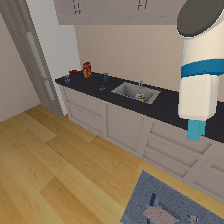
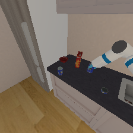
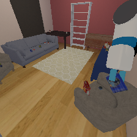
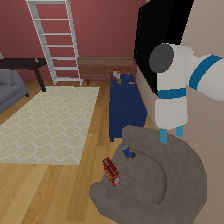

# A/B/C/D debugging and Fetch adaptation

This is a **training-scene, first-object diagnostic**, not the full five-object
TidyHouse benchmark. The task in seed 1 (`tidy_house-sequential-val-90-0`) is to
carry the blue `002_master_chef_can-0` from the kitchen counter to the seat of the
gray armchair beside the blue sofa. The earlier description of a wooden-table
destination was incorrect. The gray beanbag near the stairs is a different object.

All new runs use an oracle dispatcher to isolate the skill interfaces. They do
not use GPT/Opus or establish VLM planning gains. No external model API is called.

## Verified changes

- Human-render videos have no parameter overlay and hide the green `ee_rest_goal`
  debug sphere. Real cans retain their scene textures. A3 completed four skills
  in 248 steps; a second official recording failed at Place and is retained.
- Native head RGB was obstructed by the resting arm. An explicitly added
  `fetch_nav` camera at base-relative `[0.35,0,1.9]`, pitched down 0.15 radians,
  supplies 448x256 RGB. It is an observation augmentation, not an official-sensor
  benchmark result. The original head/wrist inputs to PPO/SAC remain intact.
- The LightNav adapter can use the upstream unicycle mapping: predicted forward
  displacement and yaw divided by the 0.25-second execution window, bounded to
  0.6 m/s and 1.2 rad/s. The original position tracker is retained as an explicit
  option. Its slow progression was a material mismatch with model cadence.
- A model STOP now commands a full second of braking and settling before checking
  completion. STOP by itself never means task success.
- Optional orientation recovery takes **boolean benchmark feedback** (close but
  not oriented) and a declared language instruction, resets LightNav history, and
  permits only model-predicted rotation. It is capped at two attempts. It does not
  read goal coordinates or relax benchmark checks; the privileged feedback must
  nevertheless be disclosed.

Source for velocity semantics: the pinned LightNav repository's
`src/lightnav/velocity.py` and `src/lightnav/habitat/policy.py`. Source for
completion semantics: [pinned MS-HAB environment](https://github.com/arth-shukla/mshab/blob/e9ff3d23496d38e4431c8d913e147ffa007f7f72/mshab/envs/sequential_task.py).

## Observed B failures and progress

| Run | Observation |
|---|---|
| B1/B2 | Clearer camera; STOP while distance check remained false |
| B3 | Route instruction with old tracker; 499-step navigation failure |
| B4 | New velocity mapping: Navigate and Pick succeeded; shared prediction cap interrupted carrying navigation |
| B5 | Navigate and Pick succeeded; carried object to target distance, kept grasp, stopped with wrong orientation |
| B6 | Repeat with route instruction did not reach the first goal within its official horizon |
| B7 | Direct goal instruction: first Navigate succeeded in 77 steps and Pick in 46; second navigation confused the beanbag with the armchair |
| B11 | Disambiguated target: all four skills succeeded in 77/47/115/39 steps; held-object check true on all 115 carrying steps; zero orientation-recovery calls |

Service-start/connection failures are logged separately from executed model
failures. Success is not established by any individual successful component.
The [complete B chain](media/B-lightnav-sac.mp4) is now verified for one object.
[A's clean reference video](media/A-ppo-sac-clean.mp4) uses the same camera augmentation.

## Fetch pi0.5 adaptation

`scripts/fetch_openpi.py` runs inside the isolated, pinned openpi environment
(`215abfb217dbac7d5f1273282331b9b1866c0479`). It converts successful continuous
Pick/Place segments to LeRobot, computes training-only normalization, fine-tunes
`pi05_base`, and serves a Fetch-specific checkpoint. No DROID action padding is
used. The policy owns all 13 normalized controller channels during manipulation.

Data contains native 128x128 head/wrist RGB, named 15-joint qpos, language, and
the 13 actions after official wrapper masking. Each action is paired with its
pre-action frame and its actual next-step event. Failed teacher segments are
excluded; their original runs remain available. Navigation actions are not used
as manipulation training examples.

The initial **vision-only** pilot used 118 frames and 200 LoRA steps. Training
loss decreased to about 0.11, but C1 failed Pick after 173 manipulation steps.
Audit found that copying LIBERO's `discrete_state_input=False` omitted joint
conditioning from pi0.5 despite carrying the state through the wire interface.
It also retained pre-mask head-action labels. This pilot is a failed experiment,
not an accepted Fetch policy.

The corrected configuration enables discrete state input and matches the actual
post-wrapper action events. A live tokenizer check confirmed that changing the
15 joint values changes the input tokens. The runtime rejects checkpoints that
do not declare the Fetch action contract **and** active state conditioning.
The corrected 2,000-step run used 785 frames across 20 successful manipulation
segments, including B11's actual handoff states. It completed, but both control
variants still failed Pick:

| Run | Navigation | pi05 execution | Actual result |
|---|---|---|---|
| C2 | PPO, 29 steps | 1 step per prediction | Pick failed after 78 steps; cumulative force exceeded the limit; never grasped |
| C3 | PPO, 29 steps | 10 steps per prediction | Pick failed after 86 steps |
| D1 | LightNav, 77 steps | 10 steps per prediction | Pick failed after 80 steps |

[C2 failure video](media/C-pi05-state-failed.mp4) and
[D1 failure video](media/D-lightnav-pi05-state-failed.mp4) show real model control,
not successful tasks. Neither rollout switched to SAC manipulation. Training
loss at step 1990 was 0.0310; that number did not predict task success.

The velocity-input pilot kept the same 785 training frames, added the measured
15-joint velocity to the 15-joint position, and warm-started from this Fetch
checkpoint. After 2,000 steps it still failed Pick: C4 used 10 actions per
prediction (87 manipulation steps, 9 predictions); C5 used one action per
prediction (120 manipulation steps, 120 predictions). D2 was not run.
C4 never grasped and accumulated force 5,222.48, exceeding the unchanged limit
of 5,000. The initial action MSE to an expert at identical qpos was 0.00316;
this offline comparison did not establish closed-loop success. The inputs
add robot proprioception, not hidden
target-object coordinates. The runtime requires explicit `state_components`
metadata for this 30-value contract. A tokenizer check held qpos fixed and
confirmed that varying qvel changes 30 token positions.

```bash
# In the openpi environment, after collecting successful teacher runs:
python scripts/fetch_openpi.py convert --repo-id bvi/fetch-seed1-state-v3 --runs RUN_DIRS
python scripts/fetch_openpi.py norm --repo-id bvi/fetch-seed1-state-v3 --work WORK_DIR
python scripts/fetch_openpi.py train --repo-id bvi/fetch-seed1-state-v3 --work WORK_DIR --steps 2000 --batch 4
python scripts/fetch_openpi.py serve --repo-id bvi/fetch-seed1-state-v3 --work WORK_DIR --checkpoint CHECKPOINT_DIR
```

For the velocity pilot use a new dataset/work directory, pass
`--include-velocity` consistently to convert/norm/train/serve, and pass
`--init-checkpoint OLD_FETCH_CHECKPOINT/params` during training. The previous
checkpoint remains a distinct failed model; new weights must be evaluated before
any completion claim. The new configuration is named `pi05_fetch_lora_velocity`.

### Recovery data collection (prepared, not yet GPU-validated)

The optional `--collect-recovery-after N` mode runs N learner control steps,
then lets the official SAC teacher execute the remainder of that manipulation
skill. Only the teacher tail emits training rows. It requires `--dry-run`,
`--record-demonstrations`, and `--manipulation-policy fetch-pi05`; N is bounded
to 0..50. This can collect correction examples after learner-induced drift.

Such runs declare `mixed_teacher_collection=true` and
`manipulation_policy=fetch-pi05_then_sac_teacher`, and log the exact takeover
frame. They are training collection, not C/D evidence. `audit_chain.py` rejects
them for the candidate-task acceptance gate even if the physical task succeeds.
The local unit test verifies that learner-prefix actions are excluded from
training rows and that takeover is explicit. Its actual recovery effectiveness
has not yet been tested in simulation.

The separate `scripts/collect_recovery.py` path replays a saved failed-policy
prefix, verifies the initial RGB hashes, and then records an actual SAC recovery.
It makes zero live VLA predictions, declares `replay_only_prefix=true`, and stops
after the recovery Pick. C2-prefix trials of 5/10/20/30 steps recovered
with 48/36/35/28 SAC steps respectively; D1-prefix trials of 10/20 steps
recovered with 31/57 steps. All six succeeded as teacher recoveries, contributing
235 frames. These are correction demonstrations,
not successful C/D rollouts. Only the SAC tail is eligible for training rows.

The recovery-data pilot uses 1,020 frames across 26 segments (the original
785 plus these 235), with the same 30-value qpos/qvel and 13-action contract.
It warm-starts from the velocity pilot with a cap of 4,000 training steps.
Training was stopped after finalized checkpoint `2000` (2,001 updates under
zero-based numbering), rather than completing the planned 4,000 updates. C6
(PPO29 + Pick90) and D3 (LightNav77 + Pick112) both failed without grasping.
Increasing native denoising from10 to50 also failed: C7 Pick92, D4 Pick71.
Four same-observation predictions averaged per action failed in C8 Pick41
and D5 Pick85. Every individual draw counts toward the request cap.
The [full outcomes and model identities](results/abcd-recovery-failures.json)
and [24-request teacher-forced diagnostic](results/pi05-recovery-teacher-probe.json)
are retained. Lower offline prediction MSE did not establish task success.
The input archive SHA256 is
`5846f822403bb842234eecac98ce6f29ce651d0d645e11b5ebe709d25374d1cf`.
The velocity-pilot checkpoint archive SHA256 is
`d9231a13c20d8a37268636bd099d0ad914cd02753761c2205190080e5eddf7d9`.

### Relative base input pilot (C9/D6 failed)

The native pi05 tokenizer discretizes normalized state into 256 bins. In this
dataset the base x/y quantile ranges span about 3.18/4.16 meters, giving roughly
12.4/16.3 mm per bin. This is a possible precision limitation, not an established
cause of failure. The optional `--relative-base --include-velocity` data/config
uses measured base x/y displacement from the skill start, while leaving yaw,
arm/finger joints and all velocities unchanged. Offline ranges shrink to
0.863/1.171 meters, approximately 3.4/4.6 mm per bin. It does not consume hidden
object coordinates and does not change the 13 action channels.

This has a distinct `pi05_fetch_lora_relative` configuration and checkpoint
metadata `base_position_reference=skill_start_xy`; old checkpoints keep unshifted
root-joint coordinates. The historical metadata value `world` means the native
unshifted `robot.qpos[:2]` in this implementation, not `base_link.pose.p` in the
scene frame. The transform subtracts joint-coordinate offsets at skill start;
it is not an SE(2) transformation into the current robot frame.
Recovery tails use the **original learner skill-start** origin,
verified against their source event hash, rather than the SAC takeover frame.
Tests verify translation invariance, unchanged other state components, and
rejection of altered recovery sources. The 1,020-frame relative-input pilot completed 2,000 updates from
the recovery checkpoint. C9 completed PPO navigation in 29 steps, then failed
Pick after 200 pi05 predictions without grasping. D6 completed LightNav navigation
in 85 steps (17 predictions), then failed Pick after 73 pi05 predictions with
cumulative force 5,042.78 and no grasp. Both used chunk size 1 and 10 denoising
steps. Relative coordinates did not establish task success. The full checkpoint
archive SHA256 is `7afd283434da5d427851b9fd382c8fdc06c458883a3e11eb677ee561a4e58cb3`. Its final
checkpoint stores the executed training state contract; the server rejects
mismatched world/relative flags and requires this manifest for relative models.

The [action-trace re-audit](results/abcd-control-reaudit.json) confirms that C9/D6
applied the logged bounded pi05 actions, after the declared stationary-head mask.
They were genuine learned-policy control failures, not merely unused inference
calls. [Clipping diagnostics](results/pi05-relative-action-clipping.json) record
138/200 C9 steps and 29/73 D6 steps with at least one raw component outside [-1,1].
The largest magnitude was about 1.376 in C9 and 1.151 in D6. Bounds enforcement
does not itself establish a good policy or explain every failure.

The current data intentionally overlaps the seed-1 diagnostic. A successful
overfit demo would demonstrate closed-loop control, not held-out generalization.
Benchmark evaluation requires a separately declared training/evaluation split.
Specifically, these examples use the benchmark's **validation** initialization
`val/tidy_house/episode_18.json` for engineering adaptation. They cannot be counted
as held-out validation scores. A benchmark study must use permitted training
data and untouched evaluation episodes, with a declared sensor protocol.

## Pinned upstream static-check caveat

The pinned ManiSkill Fetch `is_static()` compares joint velocities directly to
positive thresholds without taking absolute values (`body_qvel <= threshold`
and `base_qvel <= base_threshold`). Negative velocities can therefore pass
regardless of magnitude. In C4/C5 the navigation handoff reports static while
base qvel is approximately (-0.563, -0.819, -0.196), about 0.99 m/s planar speed.
B11 also reports static with approximately -1.20 rad/s base angular velocity.
This is a verified sign-check issue in the pinned implementation, not proof that
it is the sole cause of pi05 failure. Existing runs retain the official checks;
no success result was manufactured by changing them. Future handoff evaluation
must inspect absolute measured velocity independently of this boolean.

Source: [pinned Fetch implementation, is_static](https://github.com/haosulab/ManiSkill/blob/17121e3f96e3ee3ed0c03610b17f8bc2864617af/mani_skill/agents/robots/fetch/fetch.py#L400).

## Result fields

### Workspace camera preparation

Native head/wrist RGB views often occlude the counter or place the can at the
image edge. A fixed robot-mounted oblique RGB camera (`fetch_workspace`, 224×224)
was tested by replaying 90 recorded A3 control steps from the native reset.
This is **sensor inspection, not a VLA rollout**: no live model requests, no
C/D success claim and no new training labels. All three original initial image
hashes matched A3 and the official RL depth inputs stayed unchanged. The run
took 77.26 seconds while sharing the GPU with training. The first launch failed
before control because the asset environment was not sourced; both attempts
are preserved in the archive.

The added camera is attached to `base_link` at [0.35, 0.35, 1.5] m, with
pitch 0.65 rad and yaw -0.35 rad; it is not the external video camera.
[Probe record](results/workspace-camera-probe.json).




`--workspace-camera` adds this sensor to the diagnostic runner.
`fetch_openpi.py --base-camera fetch_workspace` selects it consistently for
dataset conversion and model metadata. The client checks this metadata and
rejects a missing camera. Existing models default to head/wrist; the active
relative-base experiment does not use this new camera. No camera-aware policy
success is claimed. `replay_teacher_views.py` can create separately labelled
training-only observations from recorded controls; it verifies native task
transitions and records current state rather than copying old state labels.

Longer replays did not reliably reproduce the source's task boundaries. The
attempts, including bounded repetitions of the final recorded action, are saved
as unsuccessful re-render experiments. The camera pilot therefore switched to
new **live official SAC demonstrations**, with PPO or LightNav navigation.
These runs carry `--training-collection`; their successful individual Pick/Place
segments may train pi05, but they are not C/D results. This changes both the
camera and the data samples, so it is not a strictly matched-data causal ablation.
The live-camera checkpoint completed 2,000 updates and failed four online tests.

The 14 live collections produced 13 successful Pick segments and three successful
Place segments (693 frames from 13 sources). One failed LightNav-to-Pick source
was excluded. The verified source archive SHA256 is
`7d135fc4b3ce41dbcef69e797cfd32da9f388230ca21c5cd383c919cee187591`.
All 14 resets used `tidy_house-sequential-val-90-0` and
`val/tidy_house/episode_18.json`; these are training diagnostics, not held-out
scores. A 2,000-update warm-start pilot uses the new 224×224 workspace image,
the native 128×128 wrist image and the same 30-value relative-root proprioception.

The workspace view also shows the gripper, can and armchair during an actual
successful **official teacher** Place:




### Teacher/student observation gap

V7 results (same checkpoint, 10 denoising steps):

| Run | Navigation | Executed chunk | Total steps | pi predictions | Grasped | Result |
|---|---|---:|---:|---:|---|---|
| C10 | PPO | 1 | 76 | 47 | No | Pick force failure |
| D7 | LightNav | 1 | 161 | 86 | No | Pick force failure |
| C11 | PPO | 10 | 126 | 10 | No | Pick force failure |
| D8 | LightNav | 10 | 170 | 10 | No | Pick force failure |

The executed controls match the logged pi actions after declared clipping and
stationary-head masking. There is no SAC manipulation fallback in these runs.
[Full audits](results/abcd-workspace-failures.json),
[C10 failure video](media/C-pi05-workspace-failed.mp4),
[D7 failure video](media/D-lightnav-pi05-workspace-failed.mp4).
The V7 inference archive SHA256 is
`7892c5f1bfadbafc1feeee7ee4b3f5c510e68972a60a20d19a9abda9c1718550`.

A 24-prediction teacher-forced check fits several PPO teacher observations much
better than a selected LightNav teacher observation. This small, selected check
is diagnostic only, not an estimate of dataset-wide error or task performance.
[Probe details](results/pi05-workspace-teacher-probe.json).
V8 is collecting live V7 prefixes followed by SAC recovery, with unchanged RGB
and proprioceptive inputs. Only completed successful recovery segments may train
the model; mixed teacher trajectories remain excluded from C/D evaluation.

The pinned sequential environment's `_get_obs_extra` supplies TCP pose, object
pose and goal position relative to the base, plus the grasp flag. The official
depth wrapper concatenates these extra fields into the RL state. In contrast,
the current pi05 student receives RGB and measured qpos/qvel only. It does not
receive the simulator's object/goal poses or grasp flag as policy inputs.
Therefore A/B versus C/D changes observations as well as the policy algorithm;
this is not a controlled algorithm-only comparison. A future native-state pi05
diagnostic must declare those privileged inputs separately and must not be
presented as RGB-plus-proprioception capability.

Sources: [sequential observation construction](https://github.com/arth-shukla/mshab/blob/e9ff3d23496d38e4431c8d913e147ffa007f7f72/mshab/envs/sequential_task.py#L1466),
[official depth/state wrapper](https://github.com/arth-shukla/mshab/blob/e9ff3d23496d38e4431c8d913e147ffa007f7f72/mshab/envs/wrappers/observation.py#L28).

`first_object_chain_success` requires four consecutive successful
Navigate/Pick/Navigate/Place invocations. `task_success` retains the environment's
full-task result. `benchmark_result` stays false for this diagnostic runner.
Video, checkpoint identity, all model requests, actual actions and feedback must
agree before a C/D success claim is made.
