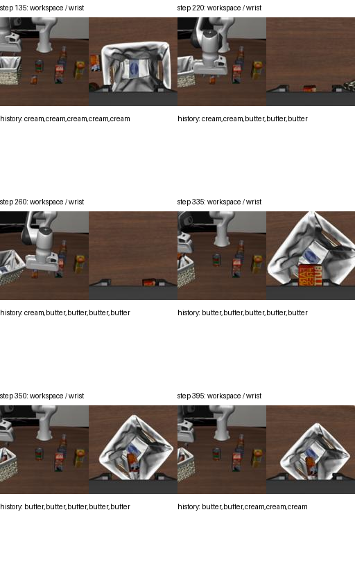

# TAPT007：离线失败归因

本分析保留 run01 的全部原始成绩，不把校验修复视为在线任务成功。没有重新训练或调用 GPU/API。

## 结论与证据边界

1. **六次中断的直接原因是协议实现错误。** JSON Schema 限制 160 个字符，旧执行器限制 160 个 UTF-8 字节；六条指令都是 160 字符、161–165 字节。它们未执行动作便被拒绝。修复已存在；TAPT008 将默认值改为 `schema-characters`。复现旧结果须显式指定 `--instruction-limit-mode legacy-bytes`。不能据此断言这六个 episode 修复后会成功。
2. **episode002 的终止原因是 20 次请求耗尽，而不是 520 步耗尽。** 实际执行 425 步；最后 75 步用于奶酪恢复，没有记录到目标双指接触候选。
3. **新确认的接口缺陷：缺少跨调用的对象状态记忆。** 执行器仅发送 `history[-5:]`。第 335、350 步的五条历史全部属于 butter；奶酪的抓取、搬运和释放证据不再提供给 GPT。请求使用独立 Responses 调用，未传 `previous_response_id`。这说明信息丢失确实存在；其对成功率的因果贡献仍需对照实验。
4. **新确认的控制决策风险：低进度超时后仍允许直接抓取。** 第 20 步 reach 以 0.416 超时，GPT 随即选择 grasp；第 220 步 reach 以 0.744 超时，也切换 grasp，后续 40 步无 butter 双指接触候选。第 395 步 reach 以 0.159 超时，仍选择 grasp，最终未恢复。它们不是“学习进度误报完成”：触发原因明确是 `step_limit`，高层没有完成前提约束。
5. **场景扰动已确认，但碰撞主体未确认。** 篮子在第 211 步首次水平偏移超过 1 cm，第 247 步达到 9.39 cm；发生于 butter 的 reach/grasp 段。缺少完整接触对、篮子旋转及原生子目标真值，不能把责任精确归到某个指尖或断言哪个物体不在篮子内。

## GPT 实际看见了什么

图片由本地桥接请求的 JPEG 原字节解码得到，没有从演示画面猜测模型输入。每组左侧是 workspace，右侧是 wrist，均为实际 128×128 输入。

第 335、350、395 步腕部画面仍能看到篮子和包装物，工作区画面的篮子则位于左侧边缘。第 350 步 GPT 却要求接近“桌面中左部”的奶酪；此后没有形成目标接触。这支持视觉定位/对象状态跟踪失误的判断，但包装物遮挡和分辨率限制使我们不能仅靠图片判定原生 In 谓词。

## 为什么低验证损失没有带来任务成功

训练进度标签是示范片段内的归一化时间，损失衡量对此时间代理的拟合，不是在线抓取成功概率或容器包含判据。验证轨迹虽与训练轨迹隔离，但没有覆盖本次篮子被推移后的失败恢复状态。因此 progress RMSE 0.0736 和 28 次学习事件证明组件能预测并驱动切换，不能证明完成判定可靠，更不能证明长程恢复能力。

另有指令质量问题：episode002 第 285 步指令结尾含 `without||||`，其他调用存在不完整短语。应保留原始文本并单独评估语言质量；仅修正字符计数不会修复这些文本。现有证据不足以证明异常尾部由哪种服务端生成机制引起。

## 下一轮最小诊断顺序

1. 固定同一检查点、任务、初始化和预算，仅启用字符校验修复，先重测被截断 episode；不混入新提示词或重新训练。
2. 对 episode002 回放已记录动作，增加每对象原生 In 真值、contain site 位置/旋转/边界、全部机器人—篮子接触对和仿真状态。无需 GPT 或 VLA 推理即可定位首次物理偏离；先验证重放位置与原轨迹一致，再使用其谓词结果。
3. 独立增加对象级历史摘要：记录“已尝试释放、来源为 learned、尚未原生确认”，不能把学习阈值写成确定成功。与仅修校验版本比较，保留相同预算。
4. 再单独验证低进度超时后的重新定位机制。若加入仿真真值接管，仅作为 oracle 诊断对照，不能算论文方法成功。

暂不调整 LoRA、阈值或延长训练：当前证据首先指向协议、任务记忆和恢复决策，无法独立证明权重是主要原因。

## 原始证据

- [六条拒绝记录](../../results/tapt-libero-2026-09-15-run01/protocol-rejections.json)
- [已有物理扰动统计](../../results/tapt-libero-2026-09-15-run01/failure-analysis.json)
- [完整批次报告](../../tapt-libero-run01.md)
- 原始视频：[vlm-tapt-episode002-failed.mp4](../../media/tapt-libero-2026-09-15-run01/vlm-tapt-episode002-failed.mp4)，保留原文件，不覆盖。
- 代码：`scripts/eval_libero_family.py`、`src/bvi/providers.py`、`scripts/train_libero_family.py`。

本次分析新增研究 GPU/API 消费为 $0；历史消费与持续存储仍以项目资金账本为准，本分析未重新核对供应商账单。
