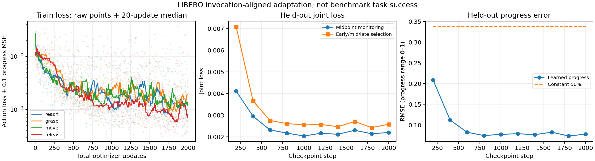

# LIBERO tool-family/TAPT component reproduction — run01

Status: training and all 15 evaluations completed, 2026-09-15. **Component/interface acceptance passed; trained-system task-success acceptance failed.** This is an invocation-aligned adaptation of an **already LIBERO-trained** pi0.5 model. It omits DROID intermediate post-training and does not reproduce the paper's score. MS-HAB migration has not started.

| Configuration | Native successes | GPT requests | API estimate (USD) |
|---|---:|---:|---:|
| Original pi05_libero, full-task instruction | 5/5 | 0 | 0 |
| GPT + original pi05_libero, rule feedback | 3/5 | 47 | 0.0093094 |
| GPT + four tool-family adapters + learned progress | 0/5 | 53 | 0.0105086 |

These are observed outcomes on five fixed initial states of one task, not a LIBERO-suite score. Six episodes were truncated by an implementation defect in instruction validation, so the table cannot establish a TAPT performance benefit or deficit. [All 15 episode outcomes, steps, switches and costs](results/tapt-libero-2026-09-15-run01/evaluation.json) · [CSV](results/tapt-libero-2026-09-15-run01/episodes.csv).

First episodes are retained: [baseline-episode000.mp4](media/tapt-libero-2026-09-15-run01/baseline-episode000.mp4), [vlm-standard-episode000.mp4](media/tapt-libero-2026-09-15-run01/vlm-standard-episode000.mp4), [vlm-tapt-episode000-failed.mp4](media/tapt-libero-2026-09-15-run01/vlm-tapt-episode000-failed.mp4). All 15 recordings, including every failure, appear in the [video index](media/tapt-libero-2026-09-15-run01/README.md). There is no successful trained-condition video to substitute for the failed first episode.

## Fixed experiment

See [machine-readable configuration](../configs/tapt-libero-run01.json), [source audit](vlas-as-tools-code-audit.md), [evaluation evidence](results/tapt-libero-2026-09-15-run01/), and [video batch](media/tapt-libero-2026-09-15-run01/).

Official OpenPI `215abfb217dbac7d5f1273282331b9b1866c0479` supplies the unmodified baseline. Author fork `f4eb160ba52b22c1e85fe432de59c24bbbac6187` supplies the progress head and LoRA-capable modules. LIBERO is pinned to `f78abd68ee283de9f9be3c8f7e2a9ad60246e95c`. Added scripts live in this repository; no hidden author-tree patch is required.

Task: LIBERO-10 task 1, both cream cheese box and butter into basket. Initial states 0–4, simulation seed 7, sampling seed 0, 20 wait steps, 520 action steps. Policy predicts 10 and executes 5 actions at a time. Baseline completed 5/5 with 241, 264, 242, 253, 284 action steps. Initial-state hashes match across all three conditions.

## What is actually trained

One frozen pi05_libero backbone; four independent LoRA banks at the author's existing insertion sites; one shared author progress head. VLM residual rank/alpha 16/16 and action-expert rank/alpha 32/32. These two experts are architectural components, **not** two tool families. Every family has residuals in both components. Selection is explicit, not inferred from the prompt. Parameters are explicit JIT arguments so switching cannot silently reuse captured previous weights.

Action flow-matching loss is retained, plus 0.1 times progress MSE. Microbatch 1, accumulation 8, AdamW 5e-5, no weight decay, global-norm clipping 1. Frozen backbone parameters are excluded from the optimizer. Actual selected/unselected hashes are recorded in `update-audit-*.json`.

Training completed **2,000 optimizer updates, 500 per family**, with finite losses and effective batch 8. The summed trainer timers were 5,327.3 seconds; this is not total GPU billing time. Each bank has 49,987,584 parameters and the shared head has 2,688,769. Ten stage checkpoints and the final optimizer state were downloaded and SHA-256 verified before resource deletion.

The validation-only selection chose **step 1,800**, locked at `2026-09-15T18:03:35.201066+00:00`, before GPT evaluation. Joint loss: **0.00242294**. Learned progress RMSE: **0.073638**, versus **0.337848** for constant 50%, over 120 fixed samples from 40 windows in five held-out demonstrations. This measures the temporal-proxy labels, not failure-detection accuracy. Selected adapter SHA-256: `8d3f1dff37b07191e7e4ee82e4ff91c7ef93a6fe13a3f3e28c823d1494d9bc61`.



Checkpoint weights are retained in the local run archive, not hosted in Git: `runs/tapt007/evidence/training-v2/step-1800/adapters.pkl`; the final resumable optimizer state is `runs/tapt007/evidence/training-v2/resume.pkl`. Public metadata and hashes identify these artifacts without committing large model binaries.

## Data and limits

Source: `physical-intelligence/libero`, the official OpenPI dataset, pinned to `a4336d589d589045d1c56423ffdf3b88a0e19b1f`. All 25 downloaded file hashes match the Hub LFS metadata at this revision. Original main-branch URLs remain in the historical manifest; the source lock and downloader use the fixed revision. Sort matching demonstration IDs, first 20 train, next 5 validation, then segment. The manifest stores per-file hashes and source URLs. There are 200 windows, 160 train and 40 validation.

The parquet export has RGB, robot state and actions but no simulator contacts. Boundaries use gripper changes, motion and manually inspected images. Empty/unsustained attempt e166:201–214 was rejected despite passing a numerical lift proxy; other failed attempts are excluded. Labels are invocation-local normalized time, **not measured task completion**. They can be wrong when the accepted boundary is imperfect. No failed clip is marked complete merely at video end. The final reported model must include held-out progress diagnostics and actual closed-loop failures.

Initial validation accidentally sampled one trajectory. Those records are retained separately. Training resumed at step 200 with optimizer state restored and the data sampler restarted at seed 7 (recorded deviation); exact executed scripts are archived. It uses complete five-trajectory validation, and only the corrected validation set is used for model selection. Periodic metrics use midpoint samples. Final selection re-evaluates every checkpoint at fixed 10%, 50% and 90% positions of all 40 held-out windows (120 samples) before any GPT test. Constant-50% progress error is also reported. Test success is never used for selection.

## Communication and evaluation

The GPT request yields versioned family + grounded instruction. Both original and trained VLA receive the validated instruction verbatim. Only the trained condition selects learned family residuals. During a call, family/instruction are fixed. Interrupt/switch drops pending actions.

The trained condition returns the author's chunk-prefix progress predictions. The checked author server emits an array while its evaluator casts progress to a scalar; this implementation uses index 0 (current-observation progress) for events and logs the complete sequence. This readout choice is explicit. Thresholds: reach/move 0.9, grasp/release 0.6; two consecutive above-threshold predictions. Replan on >0.03 regression or less than 0.03 growth across at least 10 predictions, with initial 3-prediction and replan 15-prediction cooldowns. First-call rollback is disabled as in the author evaluator. Native environment success is logged separately. The standard condition uses explicitly disclosed simulator rules. Its already-open fallback is corrected from 0.39 to 0.039 m: a calibration replay measured 0.039235 m at open, so the original value did not detect it. The author 1 mm opening-delta rule remains; opening is not proof of a stable placement. Learned thresholds are unchanged. The comparison is a **combined method comparison**, not a causal isolation of TAPT.

GPT is accessed through the local SSH file bridge with durable claims, no SDK retries, max 20 calls/episode and shared max 200/$1. Credentials stay local. Input cap 16000 bytes, two 128x128 JPEG images, max 600 output tokens, conservative reservation $0.005/request. Per-call usage and estimates are published separately from provider billing facts.

All 100 requests have returned usage records, with no unknown responses. In the trained condition, the same input/instruction/noise produced different actions for all four selected banks; the seed was reset after this probe. Actual traces verified adapter hashes, verbatim instructions and action-queue clearing. Learned progress caused **24 threshold switches and four regression-triggered replans**. Simulator diagnostics were logged but were not supplied to the trained-condition planner or used to switch its skills. There were no stagnation-triggered switches in this run.

## Failure attribution and repair status

**Confirmed implementation defect:** JSON Schema allowed 160 Unicode characters, while the local guard allowed only 160 UTF-8 bytes. Six requests met the schema but contained 161–165 bytes and were rejected: standard episodes 002/003 and trained episodes 000/001/003/004. They remain failures in the original results. [Exact rejected instructions and lengths](results/tapt-libero-2026-09-15-run01/protocol-rejections.json). This is a validation mismatch introduced by this implementation, not evidence that the VLA failed to grasp.

The initial controller stopped after standard episode002. Episodes000–002 were preserved; the remaining episodes resumed with the policy RNG advanced by exactly 158 logged predictions and the environment reset sequence advanced without replaying policy actions. The selected model, prompts, limits and initial states were unchanged. [Resumption record](results/tapt-libero-2026-09-15-run01/evaluation-resumption.json). Known length rejections now terminate only their episode; unknown infrastructure errors still stop the controller.

The corrected `schema-characters` validation mode preserves the exact instruction and matches the schema; the separate 16,000-byte API envelope limit still applies. Unicode-boundary regression tests pass in the **111-test local suite**. Run01 continues to use the explicitly retained default `legacy-bytes` mode for reproducibility. The corrected mode has **not** been evaluated in a new live batch; do not reinterpret these results as fixed.

**Separate task/recovery failure:** [vlm-tapt-episode002-failed.mp4](media/tapt-libero-2026-09-15-run01/vlm-tapt-episode002-failed.mp4) reached 425 actions and the 20-request cap without native success. Basket horizontal displacement first exceeded 1cm at step 211 and peaked at **9.39cm at step 247**, during butter reach/grasp. After a learned release completion at step 350, the planner spent another 75 actions on cream-cheese reach/grasp, with no recorded dual-finger contact on that object. The native success flag remained false. [Quantitative evidence](results/tapt-libero-2026-09-15-run01/failure-analysis.json).

Scene disturbance and ineffective visual recovery are supported by the video and traces. The exact collision cause and which final object-containment predicate failed remain unconfirmed: this run did not log full basket contacts/orientation/site bounds or separate native goal predicates. A high learned local progress value did not establish global task completion. No training-loss curve, rule fallback or edited video is used to replace that failure.

## Reproduction commands

Commands assume `/workspace/tapt` inside the temporary Linux container. Install with `bash scripts/setup_tapt_libero.sh`, then copy this repository's scripts there and `src/bvi` to `/workspace/tapt/bvi`. Never copy `.env.local` to the GPU host.

```bash
cd /workspace/tapt
export MUJOCO_GL=egl PYOPENGL_PLATFORM=egl
export PYTHONPATH=/workspace/tapt:/workspace/tapt/author/third_party/libero
author/.venv/bin/python download_libero_checkpoint.py
sim-env/bin/python download_libero_pilot.py
sim-env/bin/python review_libero_segments.py
# Inspect segmentation-contact.png and preserve reviewed exclusions.
sim-env/bin/python prepare_libero_invocations.py --data data
author/.venv/bin/python serve_libero_baseline.py
# In another shell:
sim-env/bin/python eval_libero_baseline.py --output evidence/baseline
# Stop that model server before training on the same GPU.
XLA_PYTHON_CLIENT_MEM_FRACTION=.85 author/.venv/bin/python train_libero_family.py \
 --data data --checkpoint /root/.cache/openpi/openpi-assets/checkpoints/pi05_libero \
 --output evidence/training-v2 --steps 2000 --seconds 7200
```

The commands above describe a clean run. This recorded run stopped the first trainer after step 200, restored its optimizer checkpoint in `training-v2`, and restarted the sampler at seed 7. The exact executed versions are retained in `results/tapt-libero-2026-09-15-run01/provenance/train-v1.py` and `train-v2.py`; this interruption is part of the run provenance.

After the trainer exits and releases GPU memory, select on validation data before launching either GPT condition:

```bash
author/.venv/bin/python validate_libero_family.py \
 --checkpoint /root/.cache/openpi/openpi-assets/checkpoints/pi05_libero \
 --training evidence/training-v2 --data data
python3 - <<'PY'
import datetime, json, pathlib
root = pathlib.Path('evidence')
selected = json.loads((root/'training-v2/validation-selection.json').read_text())['selected']
metadata = json.loads((pathlib.Path(selected['path'])/'metadata.json').read_text())
with (root/'evaluation-lock.json').open('x') as f:
    json.dump({'selected': selected, 'adapter_metadata': metadata,
               'locked_before_gpt_evaluation_at': datetime.datetime.now(datetime.timezone.utc).isoformat()}, f, indent=2)
PY
SELECTED=$(python3 -c "import json; print(json.load(open('evidence/evaluation-lock.json'))['selected']['path'])")
author/.venv/bin/python serve_libero_baseline.py
# Separate terminal; stop this server after all five episodes:
sim-env/bin/python eval_libero_family.py --mode standard --output evidence/vlm-standard
# SELECTED is the path from validation-selection.json, never test success.
author/.venv/bin/python serve_libero_family.py \
 --checkpoint /root/.cache/openpi/openpi-assets/checkpoints/pi05_libero \
 --adapters "$SELECTED" --audit-data data
# Separate terminal:
sim-env/bin/python eval_libero_family.py --mode tapt --output evidence/vlm-tapt
```

Before either GPT evaluation, run the bridge **on the local machine** with a working SSH alias `tapt`. Use absolute local paths for `SSH_CONFIG`, `LOCAL_ENV`, and `BRIDGE_LOGS`. Reuse the same log directory after interruption so durable claims preserve the shared limit.

```bash
python scripts/serve_vlm_bridge.py --ssh-config "$SSH_CONFIG" --ssh-alias tapt \
 --remote-bridge-dir /workspace/tapt/bridge --provider openai --model gpt-5.6-luna \
 --credentials-file "$LOCAL_ENV" --authorization-id TAPT007 \
 --max-calls 200 --max-api-cost-usd 1 --request-cost-ceiling-usd .005 \
 --max-output-tokens 600 --max-input-bytes 16000 --image-detail low \
 --reasoning-effort none --idle-timeout-seconds 5400 --max-wall-seconds 7200 \
 --output "$BRIDGE_LOGS"
```

Inspect all cost limits before starting a new paid run; the historical authorization ID does not authorize another paid experiment. Checkpoint pickle files are trusted local training artifacts; never deserialize arbitrary downloaded pickle files.

## Acceptance and next gate

Completed: environment/reset/cameras/actions/native-success checks; official baseline; disjoint 20/5 trajectory preparation; real LoRA/head training; validation-only checkpoint selection; all 15 fixed evaluations; actual learned-progress event participation; instruction/routing/queue audits; all videos, per-call usage and hashes; verified backups and resource deletion. Task-success acceptance for the trained system is **not passed**.

Before MS-HAB migration, run a separately named matched batch with `--instruction-limit-mode schema-characters` in both GPT conditions, and add per-object native goal, basket pose/contact and target-grounding diagnostics. Preserve run01. Corrected live results and robust placement/recovery are still outstanding. Subsequent Fetch observation/action/data adaptation and LightNav integration remain conditional on that gate; LIBERO arm weights or normalization are not directly transferred to Fetch.

## Cost and resource closure

GPU plus 60GB ephemeral disk: **USD1.286280 estimated**, using 2.3894 hours from creation to verified deletion; API: **USD0.019818 estimated**, 100 requests. Both are below this batch's USD5/1 limits. Provider-reported Pod usage currently covers USD0.788785; the remainder is an unbilled estimate, not an additional charge to count twice. [Batch cost record](results/tapt-libero-2026-09-15-run01/finance-summary.json).

The temporary Pod was deleted and verified absent at **2026-09-15 18:35:13 UTC**, after local backup verification. The API bridge stopped. No GPU remains running; the two pre-existing stopped Pods retain 40GB and continue approximately USD0.266667/day. Account balances were not independently verified. Full private accounting remains separate from public experiment artifacts.
